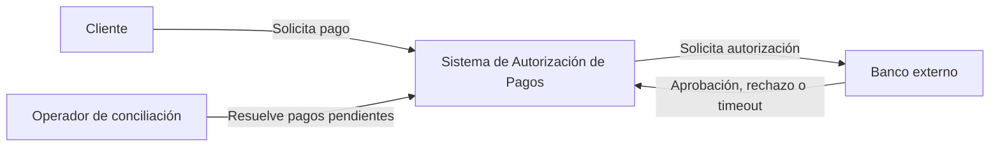
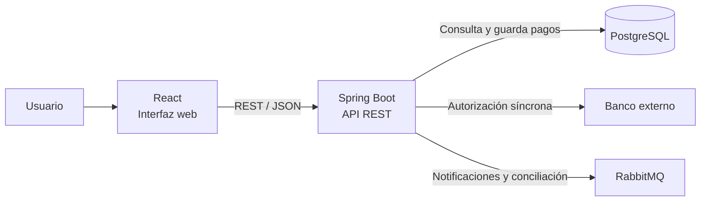
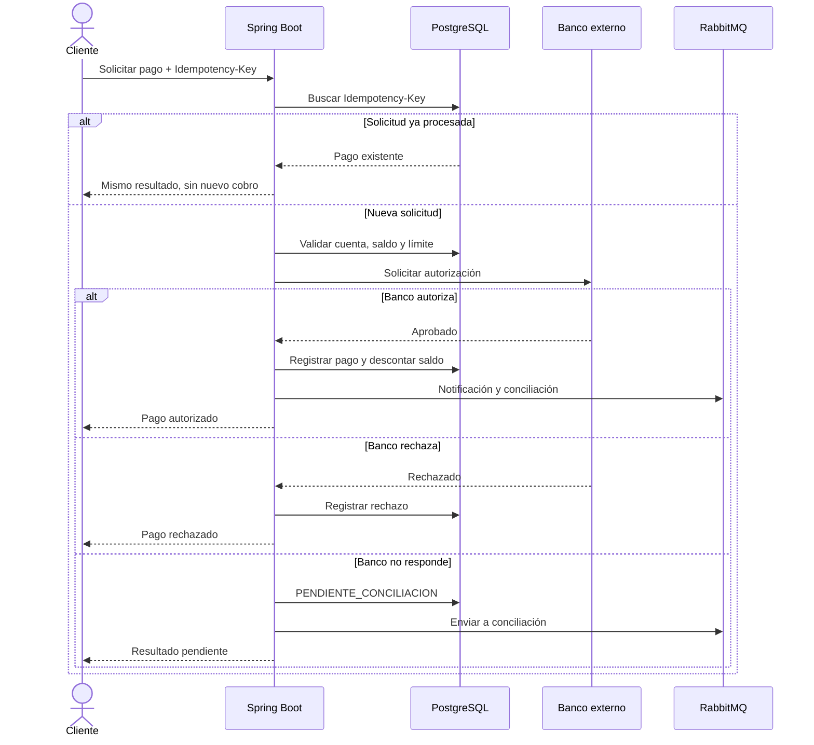

# Autorización de pagos

Sistema para una cooperativa que recibe pagos desde una aplicación móvil, valida la cuenta y sus límites, evita cobros duplicados y registra cada intento hasta su conciliación.

---

## 1. Objetivo, actores y alcance

### Objetivo

Autorizar pagos de manera segura y trazable, evitando cobros duplicados y permitiendo resolver posteriormente los casos en los que el banco externo no responda.

### Actores

- **Cliente:** solicita el pago desde la aplicación móvil.
- **Cooperativa:** valida cuenta, saldo y límites.
- **Banco externo:** autoriza o rechaza el pago.
- **Operador:** revisa y resuelve pagos pendientes de conciliación.

### Alcance

El sistema incluye:

- Validación de cuentas.
- Verificación de saldo y límite diario.
- Autorización de pagos.
- Idempotencia.
- Auditoría.
- Manejo de errores y timeout.
- Notificaciones.
- Conciliación posterior.
- Métricas.

No incluye contabilidad completa ni transferencias bancarias reales.

---

## 2. Requisitos funcionales

- **RF01:** recibir una solicitud de pago.
- **RF02:** validar que la cuenta exista y esté activa.
- **RF03:** comprobar saldo y límite diario.
- **RF04:** solicitar autorización al banco externo.
- **RF05:** evitar cobros duplicados mediante `Idempotency-Key`.
- **RF06:** registrar cada intento en auditoría.
- **RF07:** enviar notificaciones en segundo plano.
- **RF08:** enviar a conciliación los pagos con respuesta incierta.
- **RF09:** permitir confirmar posteriormente si el banco procesó o no el pago.

---

## 3. Requisitos de calidad

- **Consistencia:** un mismo intento no debe generar dos cobros.
- **Trazabilidad:** todas las decisiones y fallos deben quedar auditados.
- **Resiliencia:** una falla del banco externo no debe perder el intento de pago.
- **Rendimiento:** las validaciones locales deben responder rápidamente.
- **Mantenibilidad:** las responsabilidades deben permanecer separadas por módulos.

---

## 4. Diseño de la solución

### Operaciones síncronas

Antes de responder al cliente se realiza:

1. Validación de `Idempotency-Key`.
2. Validación de la cuenta.
3. Verificación de saldo.
4. Verificación del límite diario.
5. Solicitud de autorización al banco externo.
6. Registro del resultado.

### Operaciones en segundo plano

RabbitMQ se utiliza para:

- Notificaciones.
- Conciliación posterior.

### Idempotencia

Cada solicitud utiliza una `Idempotency-Key` única almacenada en PostgreSQL.

Si el cliente repite la solicitud con la misma clave:

- se devuelve el pago existente;
- no se vuelve a descontar el saldo;
- el reintento queda registrado en auditoría.

### Banco externo lento o no disponible

El pago pasa a:

```text
PENDIENTE_CONCILIACION
```

El sistema no vuelve a cobrar automáticamente. El resultado se resuelve posteriormente mediante conciliación.

---

# 5. Diagrama C4 — Contexto



---

# 6. Diagrama C4 — Contenedores



---

# 7. Flujo de operación crítica

La operación crítica es la autorización de un pago.



---

# 8. Stack propuesto

### Spring Boot

Implementa la API REST, validaciones, lógica de pagos y conciliación.

### PostgreSQL

Almacena cuentas, pagos, claves de idempotencia y auditoría. Se utiliza porque se necesita consistencia transaccional.

### REST

Se utiliza para las operaciones síncronas entre la interfaz y el backend.

### OpenAPI / Swagger

Documenta y permite probar los endpoints de la API.

### RabbitMQ

Procesa tareas que no necesitan bloquear la respuesta al cliente, como notificaciones y conciliación.

### React

Proporciona una interfaz web para demostrar pagos, errores y conciliaciones.

### Docker y Docker Compose

Permiten ejecutar de forma reproducible la aplicación, PostgreSQL y RabbitMQ.

---

# 9. ADR 001 — Monolito modular

**Estado:** Aceptado.

### Contexto

La aplicación contiene validación, autorización, auditoría y conciliación.

### Decisión

Utilizar un **monolito modular** en la primera versión.

### Justificación

Permite mantener las responsabilidades separadas sin introducir la complejidad operativa de microservicios.

### Consecuencias

- Despliegue más sencillo.
- Transacciones locales más fáciles.
- Si el volumen crece, conciliación o notificaciones podrían separarse posteriormente.

---

# 10. ADR 002 — RabbitMQ para conciliación y notificaciones

**Estado:** Aceptado.

### Contexto

Estas tareas no necesitan completarse antes de responder al cliente.

### Decisión

Procesarlas de forma asíncrona mediante **RabbitMQ**.

### Consecuencias

- Reduce el acoplamiento.
- Permite procesar tareas posteriormente.
- Añade un componente adicional que debe ser supervisado.

---

# 11. Riesgos y mitigaciones

### Riesgo 1 — Cobro duplicado

**Mitigación:** utilizar una `Idempotency-Key` única en PostgreSQL.

### Riesgo 2 — Banco externo no disponible

**Mitigación:** registrar el pago como `PENDIENTE_CONCILIACION` y resolverlo posteriormente sin repetir el cobro automáticamente.

### Riesgo 3 — Pérdida de trazabilidad

**Mitigación:** registrar en auditoría cada solicitud, validación, respuesta, error, timeout, reintento y conciliación.

---

# 12. Métricas

## Métrica de negocio

### Pagos duplicados evitados

Cantidad de reintentos detectados mediante `Idempotency-Key` que no generaron un segundo cobro.

## Métrica técnica

### Latencia de autorización

Tiempo desde que se recibe la solicitud hasta que el sistema genera una respuesta de autorización.

También se monitorean:

- tasa de errores;
- tiempo promedio de conciliación.

---

# 13. Pruebas principales

1. **Pago normal:** banco externo = `Responder OK`.
2. **Error externo:** banco externo = `Fallar`.
3. **Timeout:** banco externo = `No responder a tiempo`.
4. **Idempotencia:** enviar dos veces con la misma `Idempotency-Key`.
5. **Conciliación:** resolver posteriormente un pago pendiente.

---

# 14. Ejecución

Con Docker Desktop abierto:

```bash
docker compose up --build
```

Abrir:

```text
Aplicación:
http://localhost:8081

Swagger:
http://localhost:8081/swagger

RabbitMQ:
http://localhost:15672
```

Para detener:

```bash
docker compose down
```

Las variables y credenciales locales se configuran mediante el archivo `.env`, que se mantiene fuera del repositorio mediante `.gitignore`.